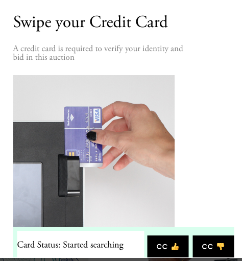

Eidolon uses CardFlight for credit card tokenization. CardFlight is like ARAnalytics, but for payment processors. We do this for flexibility in terms of hardware and software. 

So. There are a few things you should know. 

CardFlight's concept of "Test" accounts doesn't really translate well for our purposes. So when testing on staging, _do not_ use the card reader. Instead, both the swipe and manual CC input screens have the following two buttons:

(You'll need to have Admin buttons visible to see them.)

Hitting the thumbs up will use a testing credit card that succeeds, and thumbs down will use a testing credit card that will be declined.

For testing against production, go to the Admin panel and use "Testing Credit Card Reader."

